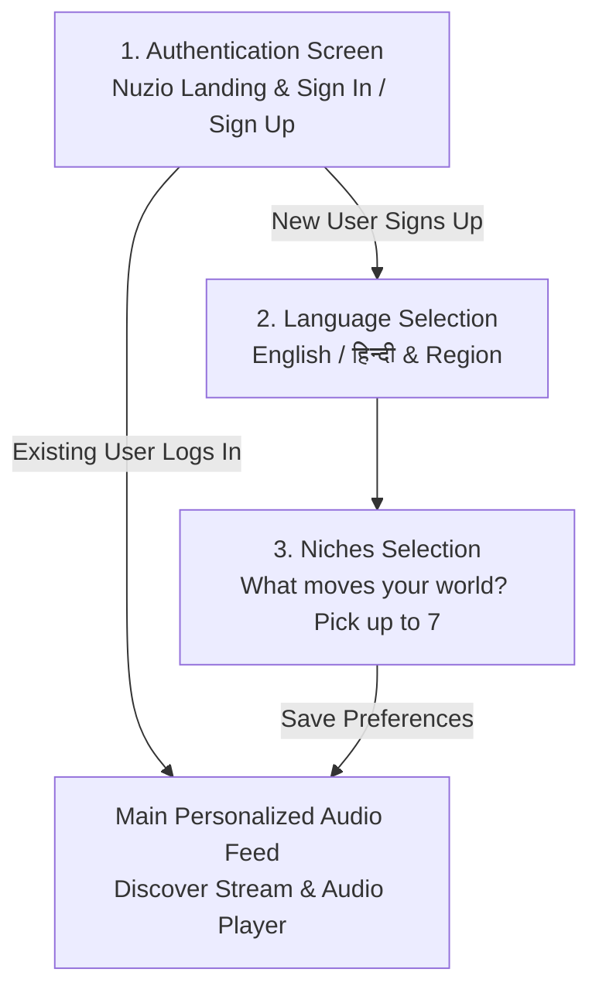

# 🎙️ Nuzio AI — Personalised Audio News

<div align="center">


**An intelligent, audio-first news briefing platform that turns global news into clear, personalized audio digests tailored to your favorite domains.**

[Features](#-key-features) • [Onboarding Flow](#-user-onboarding-flow) • [Tech Stack](#-tech-stack) • [Installation](#-getting-started) • [API Reference](#-api-endpoints) • [Project Structure](#-project-structure)

</div>

---

## 🌟 Key Features

### 🎧 Pure Audio & Listen-Only Experience
- **Crystal-Clear AI Voice Engine**: Employs studio-grade male narrator voices with calibrated news-anchor pacing (`0.90x` base rate) and natural breath pauses for maximum clarity and comprehension.
- **Voice Customization**: Easily switch between available system/browser voices (e.g., *Microsoft Guy*, *Microsoft David*, *Google UK/US Male*, *Daniel/Alex*) directly from Settings.
- **Interactive Audio Player**: Real-time synchronized scrubber seek bar, live elapsed (`00:14`) and remaining (`-02:46`) timers, and animated soundwave audio visualizer.
- **Playback Controls**: Variable playback speed (`1.0x`, `1.25x`, `1.5x`, `2.0x`), previous/next story skipping, and pause/resume.

### 📰 12 Curated News Domains (Bilingual: English & Hindi)
- Over **48+ comprehensive news stories** across 12 distinct categories:
  1. **AI & Tech**
  2. **Financial Markets**
  3. **Global Geopolitics**
  4. **Startups & Venture**
  5. **Science & Deep Tech**
  6. **Climate & Clean Energy**
  7. **Health & BioTech**
  8. **Defense & Aerospace**
  9. **Crypto & Web3**
  10. **Culture & Media**
  11. **Public Policy & Law**
  12. **Emerging Economies**

### 📱 Premium Mobile-First iOS Glassmorphic UI
- **iOS Dynamic Status Bar**: Dynamic real-time clock, live battery percentage indicator, and automatic network detection (Wi-Fi vs. Cellular Tower + 5G/LTE).
- **Discover Stream**: Dark glassmorphic cards with vibrant category badges, direct source links (`↗`), audio duration badges (`3 MIN LISTEN`), and one-tap bookmarking.
- **Fast Interactive Search & Filter**: Real-time keyword search and horizontal category pill filtering.

---

## 🚀 User Flow Architecture



1. **Step 1: Authentication Screen**: Initial entry point. Users can Sign In (Existing User) or Sign Up (New User).
2. **Existing User Flow**: When an existing user logs in, they are redirected **directly to their Main Personalized Audio Feed**, bypassing onboarding.
3. **New User Flow**: When a new user registers:
   - **2a. Language Selection**: User selects their preferred language (**English** or **हिन्दी**) and region.
   - **2b. Niches Selection**: User picks up to 7 interest domains from 12 curated categories.
   - **2c. Save & Launch**: Preferences are persisted in MongoDB and user is redirected to their **Main Audio Feed**.

---

## 🛠️ Tech Stack

### Frontend
- **Framework**: React 19 (SPA with React Router DOM)
- **Bundler**: Vite
- **Styling**: Tailwind CSS & Modern Glassmorphic Design System
- **Icons**: Lucide React
- **Audio Engine**: Web Speech Synthesis API with custom pitch, rate, and voice profile mapping

### Backend
- **Runtime**: Node.js
- **Framework**: Express.js
- **Database**: MongoDB with Mongoose ODM
- **Authentication**: Password Hashing & RESTful Auth Flow
- **CORS & Middleware**: Express JSON parser, CORS headers

---

## 💻 Getting Started

### Prerequisites
- **Node.js** (v18.0.0 or higher recommended)
- **MongoDB** running locally (`mongodb://127.0.0.1:27017`) or MongoDB Atlas URI

---

### 1. Backend Setup

```bash
# Navigate to the backend directory
cd backend

# Install dependencies
npm install

# Start backend server with nodemon or node
npm start
```
> The backend server will run on `http://localhost:3000`.

#### Backend `.env` configuration (Optional):
```env
PORT=3000
MONGO_URI=mongodb://127.0.0.1:27017/nuzio
```

---

### 2. Frontend Setup

```bash
# In a new terminal, navigate to the frontend directory
cd frontend

# Install dependencies
npm install

# Start Vite development server
npm run dev
```
> Open your browser and navigate to `http://localhost:5173`.

---

## 📡 API Endpoints

| Method | Endpoint | Description | Request Body |
|---|---|---|---|
| `POST` | `/api/auth/signup` | Register a new user | `{ "name", "email", "password" }` |
| `POST` | `/api/auth/login` | Sign in an existing user | `{ "email", "password" }` |
| `PUT` | `/api/auth/preferences` | Save user's niches and language | `{ "userId", "niches": [...], "language": "en" }` |
| `GET` | `/api/auth/preferences` | Retrieve user preferences | Query: `?userId=...` or Header |
| `GET` | `/api/auth/users` | List registered users | — |

---

## 📂 Project Structure

```
qr code/
├── backend/
│   ├── models/
│   │   └── User.js              # Strict Mongoose schema (name, email, niches, language)
│   ├── routes/
│   │   └── authRoute.js         # Authentication & preference endpoints
│   ├── db.js                    # MongoDB connection setup
│   ├── server.js                # Express app configuration & server entry
│   └── package.json
│
├── frontend/
│   ├── src/
│   │   ├── components/
│   │   │   ├── FeedScreen.jsx     # Discover stream, Now Playing audio player & news database
│   │   │   ├── NichesScreen.jsx   # 12-niche interactive selection screen
│   │   │   ├── LanguageScreen.jsx # Language & region onboarding screen
│   │   │   ├── NuzioScreen.jsx    # Login / Sign up authentication modal & splash
│   │   │   └── IosStatusBar.jsx   # Dynamic status bar (Battery, Wi-Fi/Cellular, Clock)
│   │   ├── context/
│   │   │   ├── AuthContext.jsx    # User authentication & session state
│   │   │   ├── LanguageContext.jsx# Selected language state & switchers
│   │   │   └── NicheContext.jsx   # Selected niches & backend sync
│   │   ├── App.jsx                # Router & step-by-step onboarding controller
│   │   ├── index.css              # Glassmorphic themes & scrollbar styling
│   │   └── main.jsx               # React DOM entry point
│   ├── package.json
│   └── vite.config.js
│
└── README.md
```

---

## 🔒 User Schema in MongoDB

```json
{
  "_id": "6aac4b6558f60250800d4138",
  "name": "Aarav Sharma",
  "email": "aarav@nuzio.ai",
  "password": "hashed_password",
  "niches": ["ai-tech", "financial-markets", "startups-venture"],
  "language": "en",
  "createdAt": "2026-09-17T20:19:49.557Z",
  "updatedAt": "2026-09-17T20:19:49.557Z"
}
```

---

## 💡 Audio Engine Notes

- **Browser Compatibility**: Compatible with Chrome, Edge, Safari, Firefox, iOS Safari, and Android Chrome.
- **Voice Selection**: Automatically queries `window.speechSynthesis.getVoices()` and binds to the highest quality natural male voices available on the operating system.
- **Pacing Calibration**: `0.90x` base rate provides a calm, articulate news broadcaster tone that avoids rushed or robotic speech.

---

## 📄 License

This project is licensed under the MIT License.
