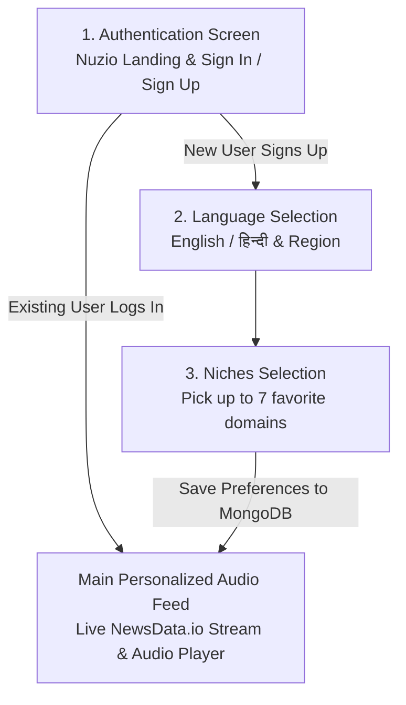

# 🎙️ Nuzio AI — Personalised Audio News

<div align="center">


**An intelligent, audio-first news briefing platform that transforms real-time global news into crisp, personalized audio digests tailored to your selected niches and language.**

[Features](#-key-features) • [News API Integration](#-live-newsdataio-api-integration) • [User Flow](#-user-flow-architecture) • [Tech Stack](#-tech-stack) • [Installation](#-getting-started) • [API Reference](#-api-endpoints) • [Project Structure](#-project-structure)

</div>

---

## 🌟 Key Features

### 📡 Live Real-Time News Stream (Powered by NewsData.io)
- **Live News Integration**: Real-time breaking headlines fetched directly from **NewsData.io API** across global publishers.
- **Bilingual Coverage (English & हिन्दी)**: Fetches and delivers native language articles in both English and Hindi.
- **Smart Niche Filtering**: Automatic category and keyword mapping for topics like *AI & Tech*, *Financial Markets*, *Indian Business*, *Sports*, *Science*, *Politics*, *Health*, and more.
- **In-Memory Caching (5-Min TTL)**: Prevents rate-limit exhaustion, preserves API credits, and ensures sub-second response times.
- **Resilient Fallback Engine**: If offline or rate limits are reached, the app seamlessly serves curated backups so playback never interrupts.

### 🎧 Pure Audio & Listen-Only Experience
- **Crystal-Clear AI Voice Engine**: Studio-grade narrator voices with calibrated news-anchor pacing (`0.90x` base rate) and natural pauses for maximum clarity and comprehension.
- **Bilingual Speech Synthesis**: Automatic native voice switching for **English** (e.g. *Microsoft Guy*, *Google US/UK*, *Natural Neural*) and **Hindi** (e.g. *Google हिन्दी*, *Swara/Madhur*).
- **Interactive Audio Scrubber**: Real-time synchronized seek bar, dynamic elapsed (`00:14`) and remaining (`-02:46`) counters, and pulsating soundwave visualizer.
- **Playback Controls**: Variable playback speed (`1.0x`, `1.25x`, `1.5x`, `2.0x`), track skipping (previous / next story), and pause / resume.

### 📱 Premium Mobile-First iOS Glassmorphic UI
- **Live Status Badges**: Pulsing green `LIVE` indicator confirming real-time NewsData.io connection.
- **One-Tap Feed Refresh**: Dedicated refresh button in the top bar with rotating animation for on-demand breaking news updates.
- **Interactive Live Search**: Real-time debounced search modal querying the live news API for any keyword or entity.
- **iOS Dynamic Status Bar**: Real-time clock, dynamic battery level indicator, and automatic network detection (Wi-Fi vs. Cellular Tower + 5G/LTE).
- **Discover Stream**: Dark glassmorphic cards with vibrant category badges, direct source links (`↗`), audio duration badges (`3 MIN LISTEN`), and one-tap bookmarking.

---

## 📡 Live NewsData.io API Integration

Nuzio AI connects to [NewsData.io](https://newsdata.io) through a dedicated backend proxy endpoint:

```
[NewsData.io API] <---> [Backend /api/news (Cache & Mapping)] <---> [Frontend Feed & Speech Narration]
```

### Supported Niche Mappings:
| App Niche | NewsData.io Category | Query Keywords / Filter |
|---|---|---|
| **AI & Tech** (`ai-tech`) | `technology` | `AI OR technology OR artificial intelligence` |
| **Financial Markets** (`financial-markets`) | `business` | `markets OR stocks OR finance OR economy` |
| **Indian Business** (`indian-business`) | `business` | Country: `in` |
| **Global Politics** (`global-politics`) | `politics` | `politics` |
| **Startups** (`startups`) | `business` | `startup OR venture OR unicorn` |
| **Science** (`science`) | `science` | `science` |
| **Geopolitics** (`geopolitics`) | `world` | `world` |
| **Health & Medicine** (`health-medicine`) | `health` | `health` |
| **Climate & Energy** (`climate-energy`) | `environment` | `environment` |
| **Sports** (`sports`) | `sports` | `sports` |
| **Culture & Arts** (`culture-arts`) | `entertainment` | `entertainment` |
| **Legal & Policy** (`legal-policy`) | `politics` | `court OR law OR policy OR legal` |

---

## 🚀 User Flow Architecture


```mermaid
graph TD
    A[1. Authentication Screen<br/>Nuzio Landing & Sign In / Sign Up] -->|Existing User Logs In| D[Main Personalized Audio Feed<br/>Live NewsData.io Stream & Audio Player]
    A -->|New User Signs Up| B[2. Language Selection<br/>English / हिन्दी & Region]
    B --> C[3. Niches Selection<br/>Pick up to 7 favorite domains]
    C -->|Save Preferences to MongoDB| D
```

1. **Step 1: Authentication Screen**: Initial entry point. Users can Sign In (Existing User) or Sign Up (New User).
2. **Existing User Flow**: Direct entry to **Main Personalized Audio Feed** with saved niche preferences.
3. **New User Flow**:
   - **Language Selection**: Choose preferred narration language (**English** or **हिन्दी**).
   - **Niches Selection**: Choose up to 7 interest domains from 12 categories.
   - **Save & Launch**: Preferences persist in MongoDB and the app loads the live news feed.

---

## 🛠️ Tech Stack

### Frontend
- **Framework**: React 19 (SPA with React Router DOM)
- **Bundler**: Vite
- **Styling**: Tailwind CSS & Modern Glassmorphic Design System
- **Icons**: Lucide React
- **Audio Engine**: Web Speech Synthesis API with custom pitch, rate, and voice profile mapping

### Backend
- **Runtime**: Node.js (ES Modules)
- **Framework**: Express.js
- **Database**: MongoDB with Mongoose ODM
- **Live News API**: NewsData.io Latest News API (`/api/1/latest`)
- **Caching**: In-Memory TTL Cache (5 minutes)
- **Security & Utilities**: CORS, Dotenv, Rate Limiting

---

## 💻 Getting Started

### Prerequisites
- **Node.js** (v18.0.0 or higher recommended)
- **MongoDB** running locally (`mongodb://127.0.0.1:27017`) or a MongoDB Atlas URI
- **NewsData.io API Key** (Free tier available at [newsdata.io](https://newsdata.io))

---

### 1. Backend Setup

```bash
# Navigate to the backend directory
cd backend

# Install dependencies
npm install

# Start backend server
npm start
# or for development with auto-reload:
npm run dev
```

> Backend server runs on `http://localhost:3000`.

#### Backend `.env` configuration:
```env
PORT=3000
MONGO_URI=mongodb+srv://<username>:<password>@cluster0.mongodb.net/
NEWS_API=https://newsdata.io/api/1/latest?apikey=your_newsdata_io_api_key
```

---

### 2. Frontend Setup

```bash
# Navigate to the frontend directory
cd frontend

# Install dependencies
npm install

# Start Vite development server
npm run dev
```

> Open your browser at `http://localhost:5173`.

#### Frontend `.env` configuration:
```env
VITE_BACKEND_URL=http://localhost:3000
```

---

## 📡 API Endpoints

### News Endpoints (Live NewsData.io)

| Method | Endpoint | Query Parameters | Description |
|---|---|---|---|
| `GET` | `/api/news` | `language` (`en`/`hi`), `niche`, `category`, `q`, `page`, `refresh` | Fetches live breaking news formatted for Nuzio audio player with caching. |
| `GET` | `/api/news/niches` | — | Returns available niche categories and metadata. |

#### Sample `/api/news` Response:
```json
{
  "success": true,
  "fromCache": false,
  "totalResults": 10,
  "count": 10,
  "articles": [
    {
      "id": "e6fbcbaa0e015912c228eb5f195bfd85",
      "nicheId": "ai-tech",
      "category": "AI & TECH",
      "categoryBg": "bg-[#231b38]",
      "categoryText": "text-[#a78bfa]",
      "title": "Amazon Ads launches Agent & DVA+ for unified buying",
      "snippet": "New generative AI agents streamline programmatic campaign buying...",
      "source": "TECHCRUNCH",
      "sourceUrl": "https://techcrunch.com/...",
      "imageUrl": "https://...",
      "pubDate": "2026-09-30 00:21:00",
      "listenTime": "2 MIN LISTEN",
      "durationMinutes": "2 MIN"
    }
  ]
}
```

### Authentication & Preferences Endpoints

| Method | Endpoint | Description | Request Body |
|---|---|---|---|
| `POST` | `/api/auth/signup` | Register a new user | `{ "name", "email", "password" }` |
| `POST` | `/api/auth/login` | Sign in an existing user | `{ "email", "password" }` |
| `PUT` | `/api/auth/preferences` | Save user's niches and language | `{ "userId", "niches": [...], "language": "en" }` |
| `GET` | `/api/auth/preferences` | Retrieve user preferences | Query: `?userId=...` or `?email=...` |
| `GET` | `/api/auth/users` | List registered users | — |
| `GET` | `/api/health` | Backend health check | — |

---

## 📂 Project Structure

```
audio news/
├── backend/
│   ├── models/
│   │   └── User.js              # Mongoose schema (name, email, niches, language)
│   ├── routes/
│   │   ├── authRoute.js         # Authentication & user preference routes
│   │   └── newsRoute.js         # NewsData.io live news proxy, caching & formatting
│   ├── db.js                    # MongoDB connection helper
│   ├── server.js                # Express app entry point
│   ├── .env.example             # Example environment variables
│   └── package.json
│
├── frontend/
│   ├── src/
│   │   ├── components/
│   │   │   ├── FeedScreen.jsx     # Discover stream, Now Playing audio player & live API hook
│   │   │   ├── NichesScreen.jsx   # Interactive 12-niche selector
│   │   │   ├── LanguageScreen.jsx # Bilingual language & region onboarding
│   │   │   ├── NuzioScreen.jsx    # Login / Sign up authentication modal
│   │   │   └── IosStatusBar.jsx   # Dynamic iOS status bar (Battery, Wi-Fi/Cellular, Clock)
│   │   ├── context/
│   │   │   ├── AuthContext.jsx    # Authentication & user session state
│   │   │   ├── LanguageContext.jsx# Selected language state (English / हिन्दी)
│   │   │   └── NicheContext.jsx   # Selected niches & backend sync
│   │   ├── App.jsx                # Route management & onboarding orchestration
│   │   ├── index.css              # Glassmorphic themes & scrollbar styling
│   │   └── main.jsx               # React DOM entry point
│   ├── package.json
│   └── vite.config.js
│
└── README.md
```

---

## 💡 Audio Engine Notes

- **Browser Compatibility**: Full support across Chrome, Edge, Safari, Firefox, iOS Safari, and Android Chrome.
- **Voice Selection**: Queries `window.speechSynthesis.getVoices()` and binds to high-quality natural male voices based on the active language (`en-US` / `hi-IN`).
- **Pacing Calibration**: `0.90x` base rate provides a calm, articulate news broadcaster tone that avoids robotic or rushed speech.

---

## 📄 License

This project is licensed under the MIT License.
